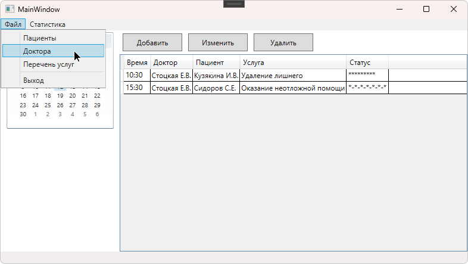
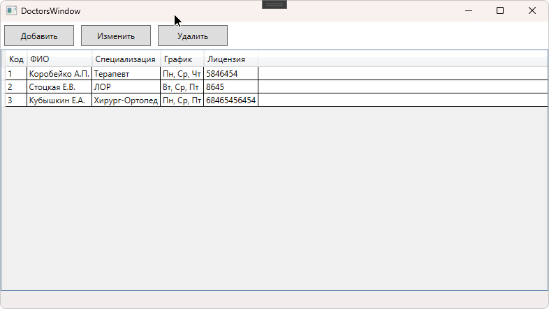
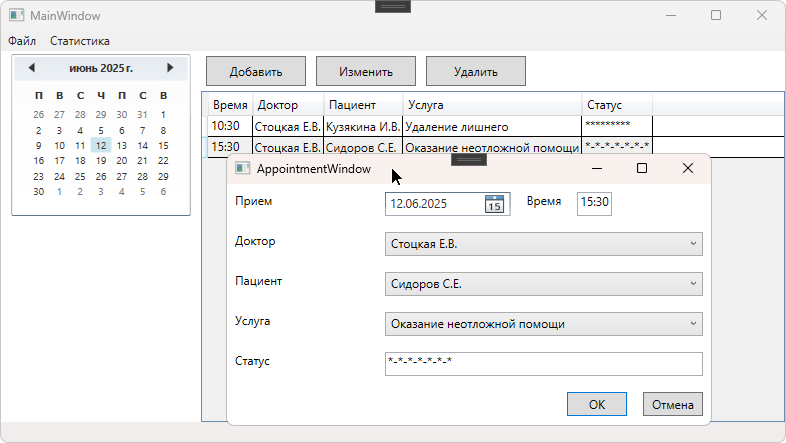
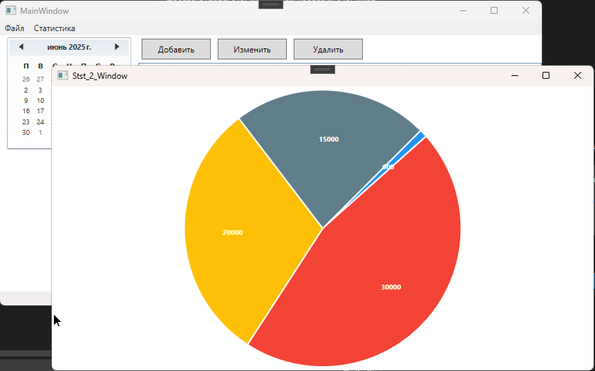

# Учет пациентов и услуг медицина

Требуется разработать WPF-приложение для автоматизации учета пациентов, записей на прием и медицинских услуг в стоматологической клинике. 
Приложение должно позволять регистрировать пациентов, управлять расписанием врачей, фиксировать оказанные услуги и формировать финансовые отчеты.
Архитектура — MVVM.

## Требования по функциональности:

### Модель (Model)

#### Класс Patient (Пациент)

- Id – уникальный идентификатор.
- FullName – ФИО.
- BirthDate – дата рождения.
- Phone – контактный телефон.
- Email – электронная почта.
- MedicalHistory – примечания (аллергии, хронические болезни).

#### Класс Doctor (Врач)

- Id – уникальный идентификатор.
- FullName – ФИО.
- Specialization – специализация (терапевт, хирург, ортодонт).
- Schedule – график работы (дни/часы приема).
- LicenseNumber – номер лицензии.

#### Класс Appointment (Запись на прием)

- Id – уникальный идентификатор.
- PatientId – ссылка на пациента.
- DoctorId – ссылка на врача.
- DateTime – дата и время приема.
- ServiceType – тип услуги (лечение, чистка, рентген).
- Status – статус (Запланирован, Завершен, Отменен).

#### Класс MedicalService (Услуга)

- Id – уникальный идентификатор.
- Name – название услуги (пломбирование, удаление зуба).
- Cost – стоимость.
- Duration – длительность процедуры (в минутах).

#### Репозитории:

- PatientRepository – управление пациентами.
- DoctorRepository – управление врачами.
- AppointmentRepository – управление записями.
- ServiceRepository – каталог услуг.

# Реализация

Хранилище - SQL Server. EF6 Code-First. 
Графики - LiveCharts.

Скриншоты

